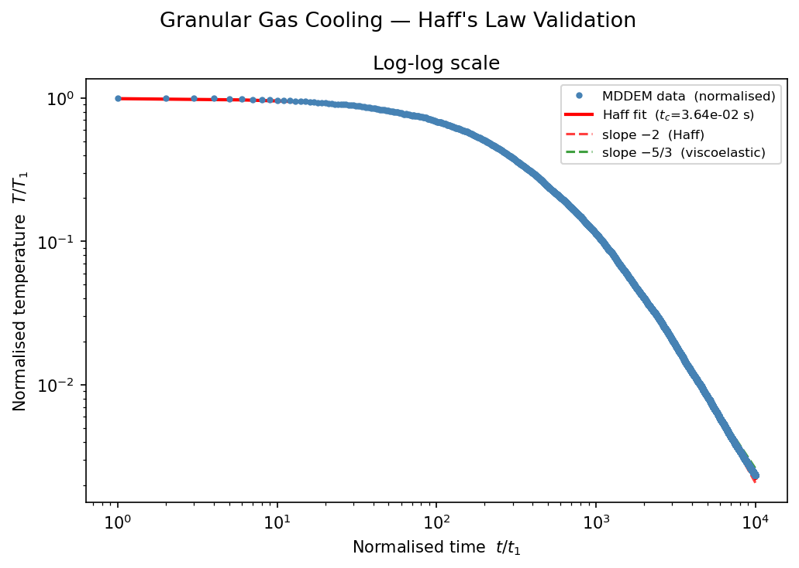

# MDDEM: Molecular Dynamics - Discrete Element Method
MDDEM (pronounced like "Madem" without the 'a') is an MPI-parallelized Molecular Dynamics / Discrete Element Method codebase written in Rust.
It uses [rsmpi](https://github.com/rsmpi/rsmpi) as a Rust wrapper around MPI and [nalgebra](https://github.com/dimforge/nalgebra) as a math library.

LAMMPS/LIGGGHTS-style MPI communication (exchange, borders, reverse force) is fully implemented for periodic boxes of spheres with Hertz normal contact and viscoelastic damping.

## Running

```bash
mpiexec -n 4 ./target/release/MDDEM ./input
```

The path to the input script is passed as the first argument. Example input:

```
processors        2 2 1
neighbor          1.1 0.005
domain            0.0 0.025 0.0 0.025 0.0 0.025
periodic          p p p

randomparticleinsert    500 0.001 2500 8.7e9 0.3
randomparticlevelocity  0.5
dampening               0.95
thermo                  500
run                     5000000
```

| Command | Arguments | Description |
|---|---|---|
| `processors` | nx ny nz | MPI domain decomposition |
| `neighbor` | skin_fraction bin_min_size | Neighbor list cutoff multiplier and minimum bin size |
| `domain` | xlo xhi ylo yhi zlo zhi | Simulation box bounds (m) |
| `periodic` | x y z | Boundary condition per axis (`p` = periodic) |
| `randomparticleinsert` | N radius density youngs_mod poisson_ratio | Insert N spheres randomly |
| `randomparticlevelocity` | v | Assign random velocities with RMS speed v (m/s) |
| `dampening` | e | Normal restitution coefficient (0–1) |
| `thermo` | interval | Print thermodynamic output every N steps; also controls GranularTemp.txt output |
| `run` | N | Number of timesteps |

## Physics

- **Contact force**: Hertz normal contact with viscoelastic damping (LAMMPS `hertz/material` equivalent)
- **Damping**: β derived from restitution coefficient e via β = −ln(e) / √(π² + ln²(e))
- **Integration**: Velocity Verlet (translational only; rotational dynamics not yet implemented)
- **Timestep**: Automatically computed as 5% of the Rayleigh wave period
- **MPI**: 3D domain decomposition with ghost atom forwarding to diagonal neighbors (corner-complete)

Not yet implemented: rotational dynamics, tangential spring history, gravity.

## Benchmark: Haff's Cooling Law

A granular gas in a periodic box with no external forcing cools inelastically. Haff's law predicts:

$$T(t) = \frac{T_0}{(1 + t/t_c)^2} \quad \Rightarrow \quad T \sim t^{-2} \text{ for } t \gg t_c$$

Running `input_benchmark` (500 particles, φ = 13.4%, e = 0.95, 5M steps ≈ 20×t_c) and analysing with `data/haff_analysis.py` gives a measured late-time log-log slope of **−1.83** (theoretical maximum at 20×t_c is −1.91).

```bash
mpiexec -n 4 ./target/release/MDDEM ./input_benchmark
cd data && python haff_analysis.py
```



## Code Layout

MDDEM is built around a dependency-injection scheduler inspired by [Bevy](https://github.com/bevyengine/bevy). All simulation state lives in typed resources. Systems declare the resources they need as function arguments and the scheduler injects them automatically.

The per-step schedule runs in this order:

```rust
pub enum ScheduleSet {
    PreInitalIntegration,
    InitalIntegration,
    PostInitalIntegration,
    PreExchange,
    Exchange,
    PreNeighbor,
    Neighbor,
    PreForce,
    Force,
    PostForce,
    PreFinalIntegration,
    FinalIntegration,
    PostFinalIntegration,
}
```

Features and systems are registered via plugins:

```rust
pub struct CommunicationPlugin;

impl Plugin for CommunicationPlugin {
    fn build(&self, app: &mut App) {
        app.add_resource(Comm::new())
            .add_setup_system(read_input, ScheduleSetupSet::PreSetup)
            .add_setup_system(setup, ScheduleSetupSet::PostSetup)
            .add_update_system(exchange, ScheduleSet::Exchange)
            .add_update_system(borders, ScheduleSet::PreNeighbor)
            .add_update_system(reverse_send_force, ScheduleSet::PostForce);
    }
}
```

`main.rs` composes the simulation by adding all required plugins:

```rust
fn main() {
    App::new()
        .add_plugins(InputPlugin)
        .add_plugins(CommunicationPlugin)
        .add_plugins(DomainPlugin)
        .add_plugins(NeighborPlugin { brute_force: false })
        .add_plugins(DemAtomPlugin)
        .add_plugins(ForcePlugin)
        .add_plugins(VerletPlugin)
        .add_plugins(PrintPlugin)
        .start();
}
```

Per-atom DEM data (radius, Young's modulus, etc.) is stored in `DemAtom`, a typed extension registered with `AtomDataRegistry`. The registry packs and unpacks these fields automatically during MPI communication alongside the base `Atom` fields.

## Future Goals

- **Library crate**: Publish to crates.io so simulations can be composed by importing plugins
- **Rotational dynamics**: Angular momentum integration and torque accumulation
- **Tangential forces**: Spring-history tangential contact model
- **GPU readiness**: Split SoA arrays into separate x/y/z vecs; flat neighbor list arrays; grid-based neighbor detection
- **LEBC**: Lees–Edwards boundary conditions for shear flow
- **Polydispersity**: Variable radius support throughout the pipeline
