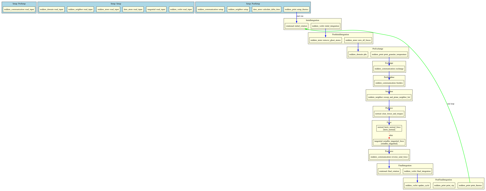

# mddem_scheduler

Dependency-injection scheduler for MDDEM, inspired by [Bevy](https://github.com/bevyengine/bevy). All simulation state lives in typed resources. Systems declare the resources they need as function arguments and the scheduler injects them automatically.

## Schedule Sets

The per-step schedule runs in this order:

```rust
pub enum ScheduleSet {
    PreInitialIntegration,
    InitialIntegration,
    PostInitialIntegration,
    PreExchange,
    Exchange,
    PreNeighbor,
    Neighbor,
    PreForce,
    Force,
    PostForce,
    PreFinalIntegration,
    FinalIntegration,
    PostFinalIntegration,
}
```

Setup systems run before the run loop, in order: `PreSetup`, `Setup`, `PostSetup`. In multi-stage simulations (`[[run]]` config), setup systems re-run at each stage boundary as `SchedulerManager.index` advances.

## Resources: `Res<T>` and `ResMut<T>`

Systems declare shared state via `Res<T>` (read) and `ResMut<T>` (read-write). The scheduler borrows them from a central `HashMap<TypeId, RefCell<Box<dyn Any>>>`.

```rust
fn my_system(atoms: Res<Atom>, mut forces: ResMut<ForceArray>) {
    // atoms is read-only, forces is mutable
}
```

## `Local<T>` -- Per-System Persistent State

`Local<T>` gives a system its own private state that persists across timesteps, initialized with `T::default()` on first use. Unlike `ResMut<T>`, a `Local` is not shared with any other system.

```rust
pub fn tangential_force(
    atoms:        Res<Atom>,
    neighbor:     Res<Neighbor>,
    mut history:  Local<HashMap<(u32, u32), Vector3<f64>>>,
) {
    // `history` retains spring displacements from the previous step.
    for &(i, j) in neighbor.neighbor_list.iter() {
        let entry = history.entry((atoms.tag[i], atoms.tag[j])).or_default();
        // ... update spring displacement, compute tangential force ...
    }
}
```

**DEM use cases**
- Mindlin-Deresiewicz tangential spring history (contact-pair displacement accumulation)
- Per-system step counters or timers without global resources
- Cached neighbor list statistics between rebuilds

**MD use cases**
- FENE bond extension history
- Thermostat state (Nose-Hoover chain variables) local to the thermostat system
- Per-system RNG state for stochastic force methods (Langevin)

## Run Conditions -- `.run_if()`

A run condition is any DI function that returns `bool`. Attach one to a system with `.run_if()`; the system is skipped when the condition returns `false`.

```rust
pub fn every_n_steps(n: u64) -> impl Fn(Res<RunState>) -> bool {
    move |run_state: Res<RunState>| run_state.total_cycle % n == 0
}

app.add_update_system(
    write_restart.run_if(every_n_steps(10_000)),
    ScheduleSet::PostFinalIntegration,
);
```

Conditions compose naturally with ordering and states:

```rust
app.add_update_system(
    compute_heat_flux
        .run_if(in_state(SimPhase::Production))
        .label("heat_flux"),
    ScheduleSet::PostForce,
);
```

**DEM use cases**
- Restart file writing every N steps
- VTK/VTP output at a coarser interval than thermo output
- Neighbor-list validity checks (rebuild only when displacement threshold exceeded)
- Contact statistics collection during production only, not during initial settling

**MD use cases**
- Radial distribution function accumulation every N steps
- Mean-square displacement logging during NVT production after an NVE equilibration
- Pressure tensor averaging on a coarser schedule than force evaluation

## System Ordering -- `.label()`, `.before()`, `.after()`

Within a `ScheduleSet`, systems normally run in registration order. Explicit ordering constraints let you express dependencies without hard-coding plugin registration order. The scheduler performs a topological sort (Kahn's algorithm) at startup and panics on cycles.

```rust
app.add_update_system(
    hertz_normal_force.label("hertz"),
    ScheduleSet::Force,
);
app.add_update_system(
    tangential_force.label("tangential").after("hertz"),
    ScheduleSet::Force,
);
app.add_update_system(
    lubrication_force.after("hertz").before("tangential"),
    ScheduleSet::Force,
);
```

Labels are plain strings and scoped to their `ScheduleSet` -- `"hertz"` in `Force` and `"hertz"` in `PostForce` are independent.

**DEM use cases**
- Normal contact must be computed before tangential contact (tangential force depends on normal overlap)
- Cohesive/van-der-Waals corrections applied after the base Hertz kernel
- Heat conduction through contacts computed after contact geometry is known

**MD use cases**
- Short-range pair forces before long-range corrections (e.g., PPPM mesh forces after real-space forces)
- Bond forces before angle/dihedral forces that read the same atom force array
- Constraint projection (SHAKE/RATTLE) strictly after all unconstrained forces are accumulated

## Simulation States

States let a simulation move through named phases (e.g., settling -> production) without `if` guards scattered across system bodies. Each state transition is deferred to `PostFinalIntegration` so the current step always completes with a consistent state.

```rust
#[derive(Clone, PartialEq, Default)]
enum SimPhase {
    #[default]
    Settling,
    Production,
}

app.add_update_system(
    compute_forces.run_if(in_state(SimPhase::Production)),
    ScheduleSet::Force,
);
```

`in_state(S)` is itself a run condition and composes with `.run_if()`:

```rust
app.add_update_system(
    accumulate_rdf
        .run_if(in_state(SimPhase::Production))
        .run_if(every_n_steps(100)),
    ScheduleSet::PostFinalIntegration,
);
```

**DEM use cases**
- **Settling -> Shear**: pack particles under gravity until kinetic energy drops below a threshold, then enable Lees-Edwards boundary shear
- **Fill -> Compress -> Release**: multi-stage die-compaction workflow; each stage activates different boundary motion systems
- **Initialization -> Production -> Quench**: granular cooling study where force model or restitution coefficient changes between phases

**MD use cases**
- **Equilibration -> NVT -> NPT**: run NVE first to relax bad contacts, couple thermostat, then couple barostat
- **Melting -> Quench**: temperature ramp systems active only in the appropriate phase
- **Steered MD -> Unbiased MD**: bias potential applied only during the pulling phase

## Schedule Visualization

Pass `--schedule` on the command line to print the compiled schedule to the terminal and write a Graphviz DOT file:

```bash
cargo run --example granular_basic -- examples/granular_basic/config.toml --schedule
```

This produces `schedule.dot` in the working directory. Generate an image with:

```bash
dot -Tpng schedule.dot -o output.png
```

The DOT output includes:
- Setup systems grouped by `ScheduleSetupSet` (blue clusters)
- Update systems grouped by `ScheduleSet` (yellow clusters)
- Red dashed edges for `.before()`/`.after()` ordering constraints
- Blue edges for implicit ScheduleSet ordering
- Green loop-back edge showing the per-step run loop

Example output:


