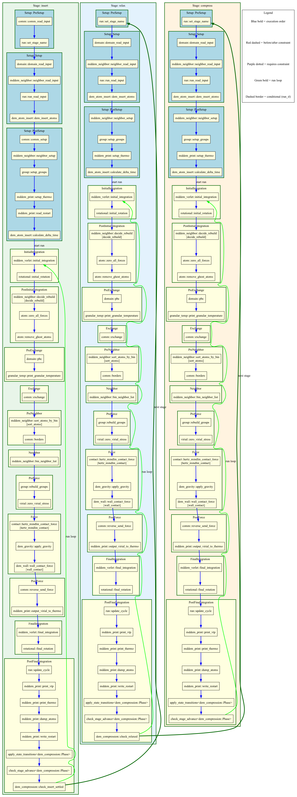

# mddem_scheduler

Dependency-injection scheduler for MDDEM, inspired by [Bevy](https://github.com/bevyengine/bevy). All simulation state lives in typed resources. Systems declare the resources they need as function arguments and the scheduler injects them automatically.

## Schedule Sets

The per-step schedule runs in this order:

```rust
pub enum ScheduleSet {
    PreInitialIntegration,
    InitialIntegration,
    PostInitialIntegration,
    PreExchange,
    Exchange,
    PreNeighbor,
    Neighbor,
    PreForce,
    Force,
    PostForce,
    PreFinalIntegration,
    FinalIntegration,
    PostFinalIntegration,
}
```

Setup systems run before the run loop, in order: `PreSetup`, `Setup`, `PostSetup`. In multi-stage simulations (`[[run]]` config), setup systems re-run at each stage boundary as `SchedulerManager.index` advances.

## Resources: `Res<T>` and `ResMut<T>`

Systems declare shared state via `Res<T>` (read) and `ResMut<T>` (read-write). The scheduler borrows them from a central `HashMap<TypeId, RefCell<Box<dyn Any>>>`.

```rust
fn my_system(atoms: Res<Atom>, mut forces: ResMut<ForceArray>) {
    // atoms is read-only, forces is mutable
}
```

## `Local<T>` -- Per-System Persistent State

`Local<T>` gives a system its own private state that persists across timesteps, initialized with `T::default()` on first use. Unlike `ResMut<T>`, a `Local` is not shared with any other system.

```rust
pub fn my_system(
    atoms:  Res<Atom>,
    mut counter: Local<u64>,
) {
    *counter += 1;
    // `counter` retains its value across timesteps.
}
```

**Use cases**
- Per-system step counters or timers without global resources
- Cached neighbor list statistics between rebuilds
- Per-system RNG state for stochastic force methods (Langevin)

Note: For per-atom data that needs to travel with atoms during MPI exchange (e.g., tangential contact history), use `AtomData` registered in the `AtomDataRegistry` instead of `Local`.

## Optional Resources: `Option<Res<T>>` and `Option<ResMut<T>>`

When a resource may or may not be present, wrap it in `Option`. The system receives `None` instead of panicking when the resource hasn't been registered:

```rust
fn my_system(thermostat: Option<Res<ThermostatConfig>>) {
    if let Some(config) = thermostat {
        // thermostat is available, use it
    }
    // otherwise, skip thermostat logic
}
```

This is useful for systems that adapt to which plugins are loaded — for example, a force system that optionally reads a damping coefficient if a damping plugin is present.

## Resource Validation at Startup

When `organize_systems()` runs, all required resources are validated. If any system requires a `Res<T>` or `ResMut<T>` that hasn't been registered, the scheduler panics with a clear error listing every missing resource:

```
Missing resources detected:
  System "nh_pre_initial" requires `md_thermostat::NoseHooverState`
  System "lj_force" requires `md_lj::LJConfig`
```

`Option<Res<T>>` and `Option<ResMut<T>>` params are not validated — they are allowed to be missing. `Local<T>` is per-system state and is also excluded from validation.

## Run Conditions -- `.run_if()`

A run condition is any DI function that returns `bool`. Attach one to a system with `.run_if()`; the system is skipped when the condition returns `false`.

```rust
pub fn every_n_steps(n: u64) -> impl Fn(Res<RunState>) -> bool {
    move |run_state: Res<RunState>| run_state.total_cycle % n == 0
}

app.add_update_system(
    write_restart.run_if(every_n_steps(10_000)),
    ScheduleSet::PostFinalIntegration,
);
```

Stage-aware run conditions are also available for `[[run]]` stage control:

```rust
// Only run during the "production" named stage
app.add_update_system(
    accumulate_stats.run_if(in_stage("production")),
    ScheduleSet::PostFinalIntegration,
);

// Only run during the first [[run]] stage (index 0)
app.add_update_system(
    initialize_velocities.run_if(first_stage_only()),
    ScheduleSet::PreInitialIntegration,
);
```

Conditions compose naturally with ordering and states:

```rust
app.add_update_system(
    compute_heat_flux
        .run_if(in_state(SimPhase::Production))
        .label("heat_flux"),
    ScheduleSet::PostForce,
);
```

**DEM use cases**
- Restart file writing every N steps
- VTK/VTP output at a coarser interval than thermo output
- Neighbor-list validity checks (rebuild only when displacement threshold exceeded)
- Contact statistics collection during production only, not during initial settling

**MD use cases**
- Radial distribution function accumulation every N steps
- Mean-square displacement logging during NVT production after an NVE equilibration
- Pressure tensor averaging on a coarser schedule than force evaluation

## System Ordering -- `.before()`, `.after()`, `.label()`

Within a `ScheduleSet`, systems normally run in registration order. Explicit ordering constraints let you express dependencies without hard-coding plugin registration order. The scheduler performs a topological sort (Kahn's algorithm) at startup and panics on cycles.

Pass **function handles** directly for type-safe, import-checked ordering — typos are caught at compile time:

```rust
app.add_update_system(hertz_normal_force, ScheduleSet::Force);
app.add_update_system(
    tangential_force.after(hertz_normal_force),
    ScheduleSet::Force,
);
app.add_update_system(
    lubrication_force.after(hertz_normal_force).before(tangential_force),
    ScheduleSet::Force,
);
```

**String labels** also work and are the right choice for systems designed to be **replaceable**:

```rust
app.add_update_system(
    hertz_normal_force.label("hertz"),
    ScheduleSet::Force,
);
app.add_update_system(
    tangential_force.after("hertz"),
    ScheduleSet::Force,
);
```

Labels are scoped to their `ScheduleSet` -- `"hertz"` in `Force` and `"hertz"` in `PostForce` are independent.

### When to use which

- **Function handles** — best for same-crate or tightly-coupled ordering where you control both sides. Refactor-friendly: renaming a function updates all references automatically.
- **String labels** — best for public API contracts where the system may be swapped out. A replacement system can adopt the same `.label("name")` so that downstream `.after("name")` / `.before("name")` constraints keep working without changes. If you use `.after(some_function)` and someone replaces `some_function` with a different implementation, the ordering silently becomes a no-op.

**DEM use cases**
- Normal contact must be computed before tangential contact (tangential force depends on normal overlap)
- Cohesive/van-der-Waals corrections applied after the base Hertz kernel
- Heat conduction through contacts computed after contact geometry is known

**MD use cases**
- Short-range pair forces before long-range corrections (e.g., PPPM mesh forces after real-space forces)
- Bond forces before angle/dihedral forces that read the same atom force array
- Constraint projection (SHAKE/RATTLE) strictly after all unconstrained forces are accumulated

## Simulation States

States let a simulation move through named phases (e.g., settling -> production) without `if` guards scattered across system bodies. Each state transition is deferred to `PostFinalIntegration` so the current step always completes with a consistent state.

```rust
#[derive(Clone, PartialEq, Default)]
enum SimPhase {
    #[default]
    Settling,
    Production,
}

app.add_update_system(
    compute_forces.run_if(in_state(SimPhase::Production)),
    ScheduleSet::Force,
);
```

When using `#[derive(StageEnum)]` with `StageAdvancePlugin` (from `mddem_app`), state transitions automatically advance the `[[run]]` stage index, so each named stage gets its own step count, thermo interval, and config overrides.

`in_state(S)` is itself a run condition and composes with `.run_if()`:

```rust
app.add_update_system(
    accumulate_rdf
        .run_if(in_state(SimPhase::Production))
        .run_if(every_n_steps(100)),
    ScheduleSet::PostFinalIntegration,
);
```

**DEM use cases**
- **Settling -> Shear**: pack particles under gravity until kinetic energy drops below a threshold, then enable Lees-Edwards boundary shear
- **Fill -> Compress -> Release**: multi-stage die-compaction workflow; each stage activates different boundary motion systems
- **Initialization -> Production -> Quench**: granular cooling study where force model or restitution coefficient changes between phases

**MD use cases**
- **Equilibration -> NVT -> NPT**: run NVE first to relax bad contacts, couple thermostat, then couple barostat
- **Melting -> Quench**: temperature ramp systems active only in the appropriate phase
- **Steered MD -> Unbiased MD**: bias potential applied only during the pulling phase

## Schedule Visualization

Pass `--schedule` on the command line to print the compiled schedule to the terminal and write a Graphviz DOT file:

```bash
cargo run --example granular_basic -- examples/granular_basic/config.toml --schedule
```

This produces `schedule.dot` in the working directory. Generate an image with:

```bash
dot -Tpng schedule.dot -o schedule.png
```

The DOT output includes:
- Setup systems grouped by `ScheduleSetupSet` (blue clusters)
- Update systems grouped by `ScheduleSet` (yellow clusters)
- Red dashed edges for `.before()`/`.after()` ordering constraints
- Blue edges for implicit ScheduleSet ordering
- Green loop-back edge showing the per-step run loop

Example output:



## Trace Mode

Set the `MDDEM_TRACE` environment variable to print every system invocation to stderr as it runs:

```bash
MDDEM_TRACE=1 cargo run --release -- config.toml
```

Output looks like:

```
[step 0] Force: md_lj::lj_force
[step 0] PostForce: mddem_core::comm::reverse_send_force
[step 0] FinalIntegration: md_thermostat::nh_final_integration
...
```

Each line shows the step number, the `ScheduleSet`, and the full system name. This is useful for debugging system ordering or identifying which system is panicking.

## Required Labels -- `.requires_label()`

Use `.requires_label()` to declare that a system depends on another system being present in the same `ScheduleSet`. If the required system is missing at startup, `organize_systems()` panics with a clear error. This catches configuration mistakes like forgetting a plugin or accidentally removing a system that another system depends on.

Both function handles and string labels work:

```rust
// Function handle — type-safe, but tied to the specific function
app.add_update_system(hertz_normal_force, ScheduleSet::Force);
app.add_update_system(
    mindlin_tangential
        .after(hertz_normal_force)
        .requires_label(hertz_normal_force),
    ScheduleSet::Force,
);

// String label — stable contract, survives system replacement
app.add_update_system(
    hertz_normal_force.label("hertz"),
    ScheduleSet::Force,
);
app.add_update_system(
    mindlin_tangential
        .after("hertz")
        .requires_label("hertz"),
    ScheduleSet::Force,
);
```

Unlike `.after()`, which silently becomes a no-op when the target is absent, `.requires_label()` enforces that the dependency exists. Use `.after()` for ordering and `.requires_label()` for correctness guarantees.

For replaceable systems, prefer string labels with `.requires_label()` — this way a replacement plugin that provides the same `.label("hertz")` satisfies the requirement without touching dependent code.

**DEM use cases**
- Tangential contact requires normal contact (overlap, normal force magnitude)
- Cohesive bond model requires a contact detection system
- Rolling resistance requires rotational dynamics

**MD use cases**
- Angle/dihedral force requires bond topology setup
- PPPM long-range solver requires real-space pair force (for splitting)
- RATTLE constraint requires unconstrained force accumulation

## Schedule Warnings

At startup, `organize_systems()` checks for suspicious schedule configurations and prints warnings to stderr. These are non-blocking — the simulation still runs — but they catch common mistakes:

1. **No Force systems** — The schedule has update systems but nothing in the `Force` set
2. **Asymmetric Verlet** — `InitialIntegration` has systems but `FinalIntegration` doesn't (or vice versa)
3. **No integrator** — Multiple update systems but neither `InitialIntegration` nor `FinalIntegration` has any

Suppress warnings with the `MDDEM_SUPPRESS_WARNINGS` environment variable:

```bash
MDDEM_SUPPRESS_WARNINGS=1 cargo run --release -- config.toml
```

**Best practice**: Always use `--schedule` to visually inspect the compiled schedule when setting up a new simulation.

## System Removal

Systems can be removed before the schedule is finalized. Pass the function handle directly for type-safe removal:

```rust
app.remove_update_system(hertz_normal_force);
app.add_update_system(custom_force, ScheduleSet::Force);
```

You can also remove by label string if needed:

```rust
app.remove_update_system_by_label("hertz");
```
